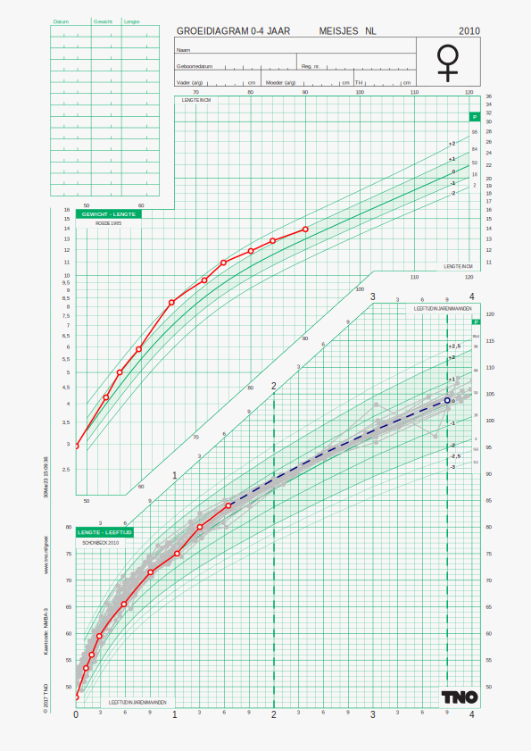

<!-- README.md is generated from README.Rmd. Please edit that file -->

```{r, include = FALSE}
knitr::opts_chunk$set(
  collapse = TRUE,
  comment = "#>",
  fig.path = "man/figures/README-",
  out.width = "100%"
)
```
# chartplotter

<!-- badges: start -->
<!-- badges: end -->

The goal of `chartplotter` is to

- plot the child's growth curves on pre-defined charts;
- plot two (visit) lines indicating a present and a future visit;
- find matches from donor data similar to the target child;
- predict the most likely future visit value;
- represent the inherent uncertainty of the prediction.

## Installation

You need two things in order to install `chartplotter`:

1. A personal access token (PAT) from
<https://github.com/settings/tokens>. I assume the token is stored in
the environmental variable `GITHUB_PAT`, so that
`Sys.getenv("GITHUB_PAT")` returns your token;

2. Access to the following private repositories:
`stefvanbuuren/curvematching` and `stefvanbuuren/donorloader`.

The following statements will install the `chartplotter` package, as
well as any of its dependencies:

```{r eval = FALSE}
install.packages("remotes")
remotes::install_github("stefvanbuuren/chartplotter")
```

## Example

The main function in `chartplotter` is `process_chart()`. 

### Example 1: Plot child's data onto a growth chart

```{r example}
library(chartplotter)
library(bdsreader)
library(svglite)
fn <- system.file("examples", "Laura_S.json", package = "bdsreader")
tgt <- bdsreader::read_bds(fn)
svglite(file = "figures/chart1.svg", height = 29.7/2.54, width = 21/2.54)
g <- process_chart(tgt, chartcode = "NMBA")
grid::grid.draw(g)
dev.off()
```

```{r displaysvg, echo=FALSE, fig.align="center", fig.cap="Dutch girls, 0-4 years"}
knitr::include_graphics("figures/chart1.svg")
```

### Example 2: Predict height at 3y9m when child is 3 months

Suppose the baby is 3 months old, and that we want to predict
the future child's height at the age of 3y9m. 
The following examples finds 25 matches to the child, and plots 
the observed curves of those matches as grey curves. 

The blue line indicates the predicted height at age 3y9m. The variation
between the grey curves at age 3y9m indicates the amount of 
uncertainty of the prediction.

```{r example2}
set.seed(61771)
svglite(file = "figures/chart2.svg", height = 29.7/2.54, width = 21/2.54)
g <- process_chart(tgt, chartcode = "NMBA", dnr = "2-4", period = c(0.25, 3.75), 
                   nmatch = 25, show_future = TRUE)
grid::grid.draw(g)
dev.off()
```

```{r display2, echo=FALSE, fig.align = "center", fig.cap="Dutch girls, 0-4 years"}
knitr::include_graphics("figures/chart2.svg")
```

### Example 3: Predict height at 3y9m when child is 2 years

Same as before, but now using all data up to (but not beyond) 
the age of 2 years. The variation between the grey curves at age 3y9m is now much smaller. 


```{r example3}
svglite(file = "figures/chart3.svg", height = 29.7/2.54, width = 21/2.54)
g <- process_chart(tgt, chartcode = "NMBA", dnr = "2-4", period = c(2.0, 3.75), 
                   nmatch = 25, show_future = TRUE)
grid::grid.draw(g)
dev.off()
```

```{r display3, echo=FALSE, fig.align = "center", fig.cap="Dutch girls, 0-4 years"}

```


### Example 4: Square plot of height, chart `NMBH`

```{r example4}
svglite(file = "figures/chart4.svg", height = 18/2.54, width = 18/2.54)
g <- process_chart(tgt, chartcode = "NMBH", quiet = FALSE, dnr = "2-4",
                   period = c(2.0, 3.75), nmatch = 25,
                   show_future = TRUE, show_realized = TRUE)
grid::grid.draw(g)
dev.off()
```


```{r display4, echo=FALSE, fig.align = "center", fig.cap="Dutch girls, 0-4 years"}
knitr::include_graphics("figures/chart4.svg")
```
