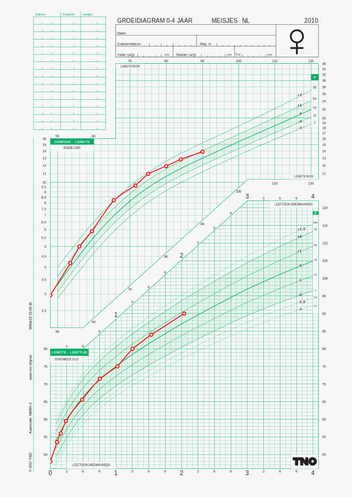
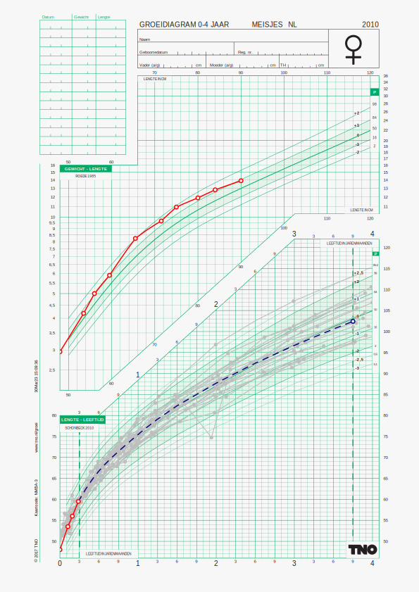

<!-- README.md is generated from README.Rmd. Please edit that file -->

# chartplotter

<!-- badges: start -->

[](https://github.com/growthcharts/chartplotter/actions)
[](https://github.com/growthcharts/chartplotter/actions/workflows/R-CMD-check.yaml)
<!-- badges: end -->

The goal of `chartplotter` is to

- plot the child’s growth curves on pre-defined charts;
- plot two (visit) lines indicating a present and a future visit;
- find matches from donor data similar to the target child;
- predict the most likely future visit value;
- represent the inherent uncertainty of the prediction.

## Installation

You need access to `growthcharts/donorloader` in order to install
`chartplotter`.

The following statements will install the `chartplotter` package, as
well as any of its dependencies:

``` r
install.packages("remotes")
remotes::install_github("growthcharts/chartplotter")
remotes::install_github("growthcharts/jamesdemodata")
```

## Example

The main function in `chartplotter` is `process_chart()`.

### Example 1: Plot child’s data onto a growth chart

``` r
library(chartplotter)
library(bdsreader)
library(svglite)
fn <- system.file("extdata", "bds_v2.0", "smocc", "Laura_S.json", package = "jamesdemodata")
tgt <- bdsreader::read_bds(fn)
svglite::svglite(file = "figures/chart1.svg", height = 29.7/2.54, width = 21/2.54)
g <- process_chart(tgt, chartcode = "NMBA")
grid::grid.draw(g)
dev.off()
#> quartz_off_screen 
#>                 2
```

<div class="figure" style="text-align: center">


<p class="caption">
Dutch girls, 0-4 years
</p>

</div>

### Example 2: Predict height at 3y9m when child is 3 months

Suppose the baby is 3 months old, and that we want to predict the future
child’s height at the age of 3y9m. The following examples finds 25
matches to the child, and plots the observed curves of those matches as
grey curves.

The blue line indicates the predicted height at age 3y9m. The variation
between the grey curves at age 3y9m indicates the amount of uncertainty
of the prediction.

``` r
set.seed(61771)
svglite(file = "figures/chart2.svg", height = 29.7/2.54, width = 21/2.54)
g <- process_chart(tgt, chartcode = "NMBA", dnr = "2-4", period = c(0.25, 3.75), 
                   nmatch = 25, show_future = TRUE)
grid::grid.draw(g)
dev.off()
#> quartz_off_screen 
#>                 2
```

<div class="figure" style="text-align: center">


<p class="caption">
Dutch girls, 0-4 years
</p>

</div>

### Example 3: Predict height at 3y9m when child is 2 years

Same as before, but now using all data up to (but not beyond) the age of
2 years. The variation between the grey curves at age 3y9m is now much
smaller.

``` r
svglite(file = "figures/chart3.svg", height = 29.7/2.54, width = 21/2.54)
g <- process_chart(tgt, chartcode = "NMBA", dnr = "2-4", period = c(2.0, 3.75), 
                   nmatch = 25, show_future = TRUE)
grid::grid.draw(g)
dev.off()
#> quartz_off_screen 
#>                 2
```

<div class="figure" style="text-align: center">


<p class="caption">
Dutch girls, 0-4 years
</p>

</div>

### Example 4: Square plot of height, chart `NMBH`

``` r
svglite(file = "figures/chart4.svg", height = 18/2.54, width = 18/2.54)
g <- process_chart(tgt, chartcode = "NMBH", quiet = FALSE, dnr = "2-4",
                   period = c(2.0, 3.75), nmatch = 25,
                   show_future = TRUE, show_realized = TRUE)
#> chartcode:  NMBH
grid::grid.draw(g)
dev.off()
#> quartz_off_screen 
#>                 2
```

<div class="figure" style="text-align: center">


<p class="caption">
Dutch girls, 0-4 years
</p>

</div>
